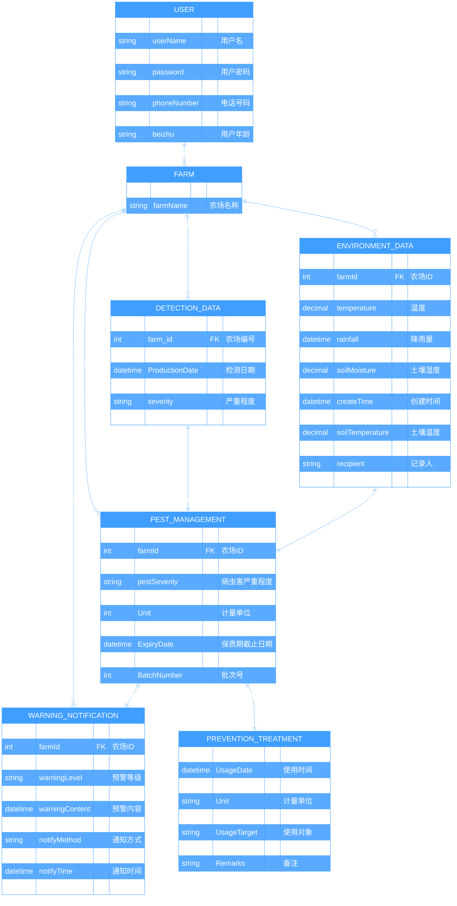

```mermaid
%%{init: {'theme':'base', 'themeVariables': {'fontSize':'30px', 'primaryColor':'#409eff', 'primaryTextColor':'#fff', 'primaryBorderColor':'#409eff', 'lineColor':'#409eff', 'secondaryColor':'#f0f2f5', 'tertiaryColor':'#fff', 'noteBkgColor':'#fff', 'noteTextColor':'#333', 'noteBorderColor':'#409eff', 'textColor':'#333', 'mainBkgColor':'#fff', 'secondaryTextColor':'#606266', 'tertiaryTextColor':'#909399', 'cScale0':'#409eff', 'cScale1':'#67c23a', 'cScale2':'#e6a23c', 'cScale3':'#f56c6c', 'cScale4':'#909399', 'cScale5':'#9d6942'}}}%%
erDiagram
    USER {
        int userId PK "用户ID"
        string userName "用户名"
        string account "用户账号"
        string password "用户密码"
        string personchkage "用户性别"
        string phoneNumber "电话号码"
        datetime createTime "创建时间"
        string beizhu "用户年龄"
    }

    FARM {
        int farmId PK "农场ID"
        string farmName "农场名称"
    }

    PEST_MANAGEMENT {
        int farmPestManageId PK "病虫害唯一ID"
        int farmId FK "农场ID"
        datetime monitoringTime "监测时间"
        string pestSeverity "病虫害严重程度"
        string affectedArea "受影响面积"
        int Unit "计量单位"
        string StorageLocation "存放位置"
        datetime ExpiryDate "保质期截止日期"
        datetime ProductionDate "生产日期"
        int BatchNumber "批次号"
    }

    DETECTION_DATA {
        int detection_id PK "检测ID"
        int farm_id FK "农场编号"
        string pest_type "病虫害类型"
        datetime ProductionDate "检测日期"
        string location "检测位置"
        string severity "严重程度"
        Text treatment_advice "处理建议"
    }

    WARNING_NOTIFICATION {
        int warningId PK "预警ID"
        int farmId FK "农场ID"
        int pestId FK "病虫害ID"
        string warningLevel "预警等级"
        string warningTitle "预警标题"
        datetime warningContent "预警内容"
        datetime warningTime "预警时间"
        string notifyMethod "通知方式"
        string recipient "接收人"
        datetime notifyTime "通知时间"
        string Remarks "备注"
    }

    ENVIRONMENT_DATA {
        int envDataId PK "环境数据ID"
        int farmId FK "农场ID"
        int pestId "批次号"
        decimal temperature "温度"
        decimal humidity "湿度"
        datetime rainfall "降雨量"
        string remarks "备注"
        decimal soilMoisture "土壤湿度"
        decimal lightIntensity "光照强度"
        datetime createTime "创建时间"
        datetime updateTime "更新时间"
        decimal soilTemperature "土壤温度"
        string notifyMethod "记录方式"
        string recipient "记录人"
        datetime notifyTime "记录时间"
    }

    PREVENTION_TREATMENT {
        string FeedID PK "病虫害防治ID"
        datetime UsageDate "使用时间"
        string Quantity "使用数量"
        string Unit "计量单位"
        string UsedBy "使用人"
        string UsageTarget "使用对象"
        string UsageMethod "使用方式"
        string Remarks "备注"
    }

    USER ||--o{ FARM : "1:N 管理"
    FARM ||--o{ PEST_MANAGEMENT : "1:N 包含"
    FARM ||--o{ DETECTION_DATA : "1:N 包含"
    FARM ||--o{ WARNING_NOTIFICATION : "1:N 包含"
    FARM ||--o{ ENVIRONMENT_DATA : "1:N 包含"
    PEST_MANAGEMENT ||--|| WARNING_NOTIFICATION : "1:1 触发"
    PEST_MANAGEMENT ||--|| PREVENTION_TREATMENT : "1:1 制定"
    DETECTION_DATA ||--|| PEST_MANAGEMENT : "1:1 检测"
    ENVIRONMENT_DATA ||--|| PEST_MANAGEMENT : "1:1 影响"
```

