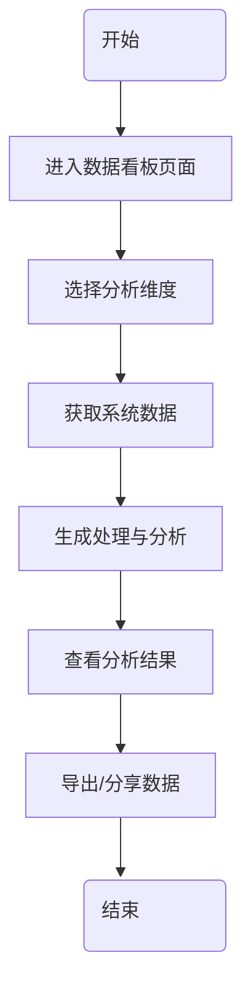

# 数据分析流程图

使用 Mermaid 语法绘制的数据分析流程图，包含椭圆形的开始和结束节点，仅使用黑白颜色。

## 说明

- **开始和结束节点**：使用椭圆形表示
- **流程节点**：使用矩形表示
- **连接线**：使用实线连接
- **流程顺序**：从上到下依次执行

## 使用方法

1. 在支持 Mermaid 的 Markdown 编辑器中打开此文件
2. 查看渲染后的流程图
3. 可以根据需要修改节点内容和样式

## 流程说明

1. **开始**：流程的起点
2. **进入数据看板页面**：用户访问系统的数据看板功能
3. **选择分析维度**：用户选择需要分析的数据维度
4. **获取系统数据**：系统根据选择的维度获取相应的数据
5. **生成处理与分析**：系统对获取的数据进行处理和分析
6. **查看分析结果**：用户查看系统生成的分析结果
7. **导出/分享数据**：用户可以导出或分享分析结果
8. **结束**：流程的终点
