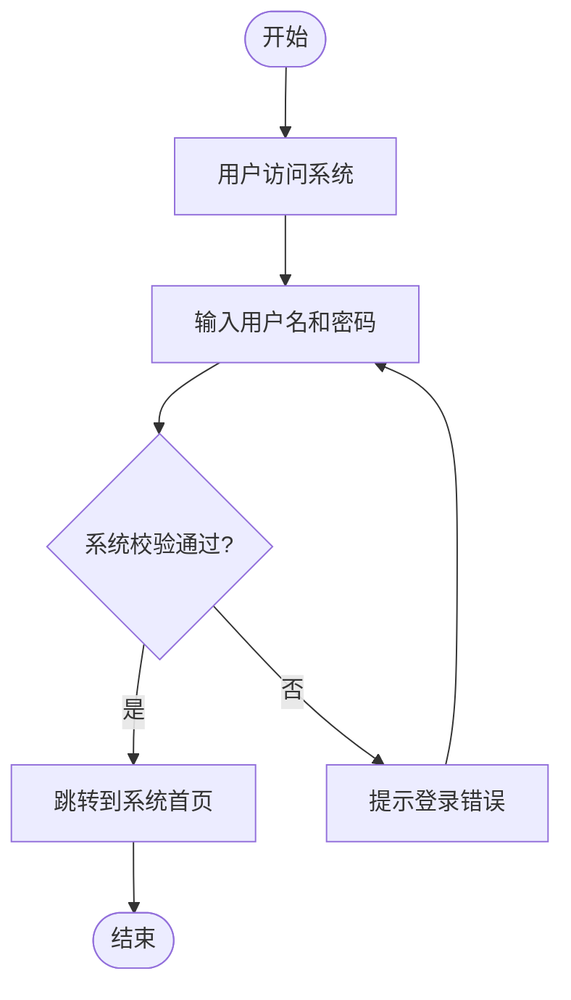

# 登录流程图

使用 Mermaid 语法绘制的登录流程图，包含椭圆形的开始和结束节点，仅使用黑白颜色。

## 说明

- **开始和结束节点**：使用椭圆形表示
- **流程节点**：使用矩形表示
- **决策节点**：使用菱形表示
- **连接线**：使用实线连接，带有"是"和"否"的分支标签
- **循环**：从错误节点到输入节点的连接线表示循环

## 使用方法

1. 在支持 Mermaid 的 Markdown 编辑器中打开此文件
2. 查看渲染后的流程图
3. 可以根据需要修改节点内容和样式

## 扩展建议

- 可以添加更多的流程节点，如验证码验证、忘记密码等
- 可以调整节点的颜色和样式以匹配项目的设计风格
- 可以添加更多的分支和循环逻辑以表示更复杂的登录流程
