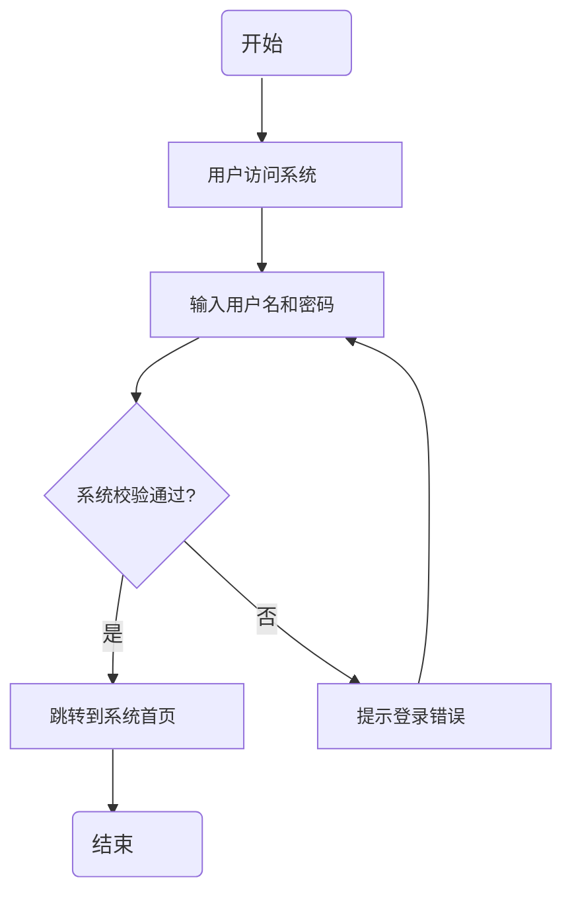

# 登录流程图

使用 Mermaid 语法绘制的登录流程图，按照用户管理流程图的样式实现，包含椭圆形的开始和结束节点。

## 说明

- **开始和结束节点**：使用椭圆形表示
- **流程节点**：使用矩形表示
- **决策节点**：使用菱形表示
- **连接线**：使用实线连接，带有"是"和"否"的分支标签
- **循环**：从错误节点到输入节点的连接线表示循环

## 流程说明

1. **开始**：流程的起点
2. **用户访问系统**：用户打开系统登录页面
3. **输入用户名和密码**：用户在登录表单中输入凭据
4. **系统校验通过？**：系统验证用户输入的凭据是否正确
5. **跳转到系统首页**：验证通过后，用户进入系统主界面
6. **提示登录错误**：验证失败时，系统显示错误信息
7. **结束**：流程的终点

## 使用方法

1. 在支持 Mermaid 的 Markdown 编辑器中打开此文件
2. 查看渲染后的流程图
3. 可以根据需要修改节点内容和样式