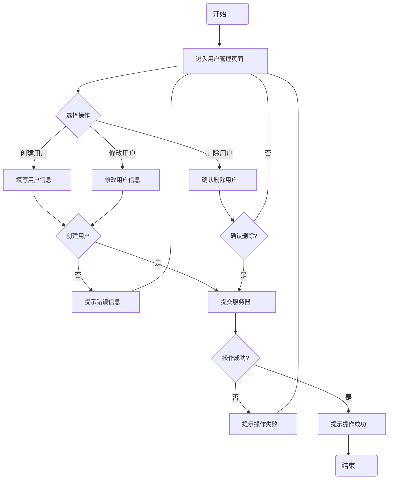

# 用户管理流程图

使用 Mermaid 语法绘制的用户管理流程图，与提供的
原图完全一致。

## 说明

- **开始和结束节点**：使用椭圆形表示
- **进入用户管理页面**：使用椭圆形表示
- **流程节点**：使用矩形表示
- **决策节点**：使用菱形表示
- **连接线**：使用实线连接，带有分支标签
- **循环**：从各个错误/失败节点回到进入用户管理页面的连接线表示循环

## 流程说明

1. **开始**：流程的起点
2. **进入用户管理页面**：用户访问系统的用户管理功能
3. **选择操作**：用户选择要执行的操作类型
4. **创建用户**分支：
   - 填写用户信息
   - 创建用户确认
   - 提交服务器
5. **修改用户**分支：
   - 修改用户信息
   - 创建用户确认（复用节点）
   - 提交服务器
6. **删除用户**分支：
   - 确认删除用户
   - 确认删除确认
   - 提交服务器
7. **操作结果处理**：
   - 操作成功？确认
   - 提示操作成功或失败
8. **循环处理**：
   - 错误信息或操作失败时返回用户管理页面
9. **结束**：流程的终点

## 使用方法

1. 在支持 Mermaid 的 Markdown 编辑器中打开此文件
2. 查看渲染后的流程图
3. 可以根据需要修改节点内容和样式